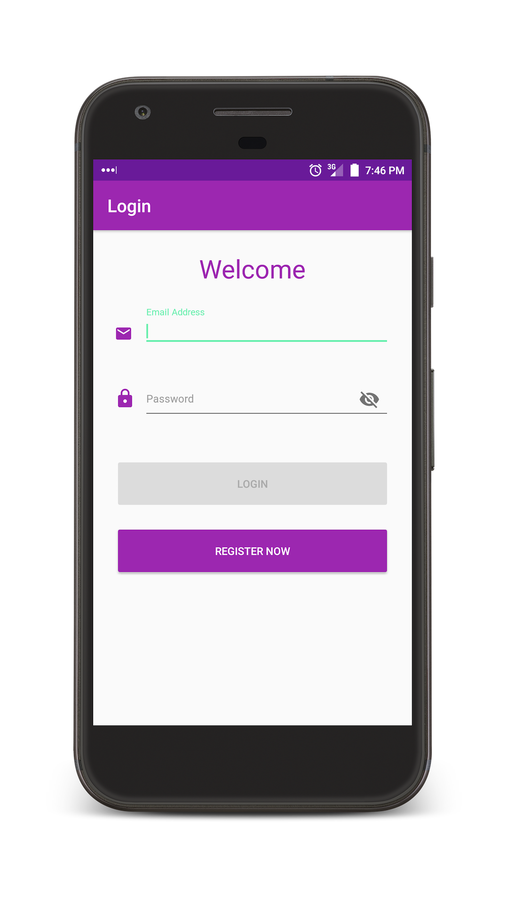
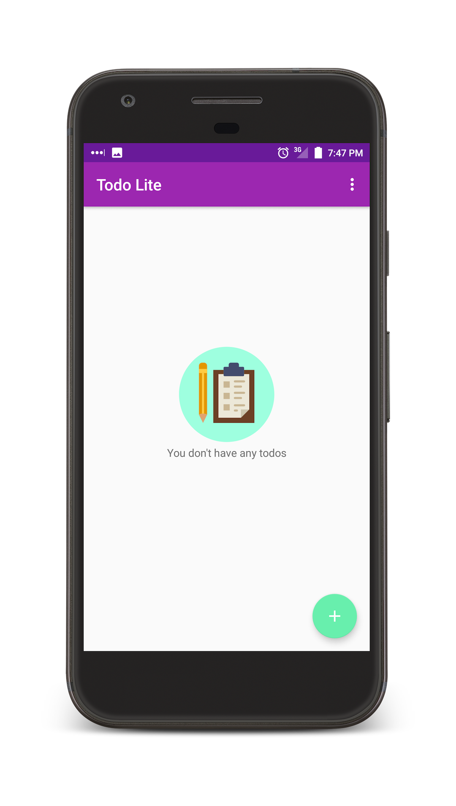
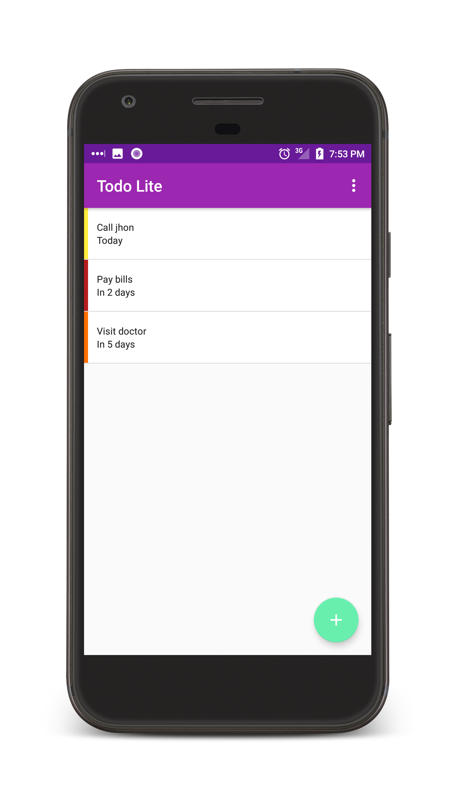
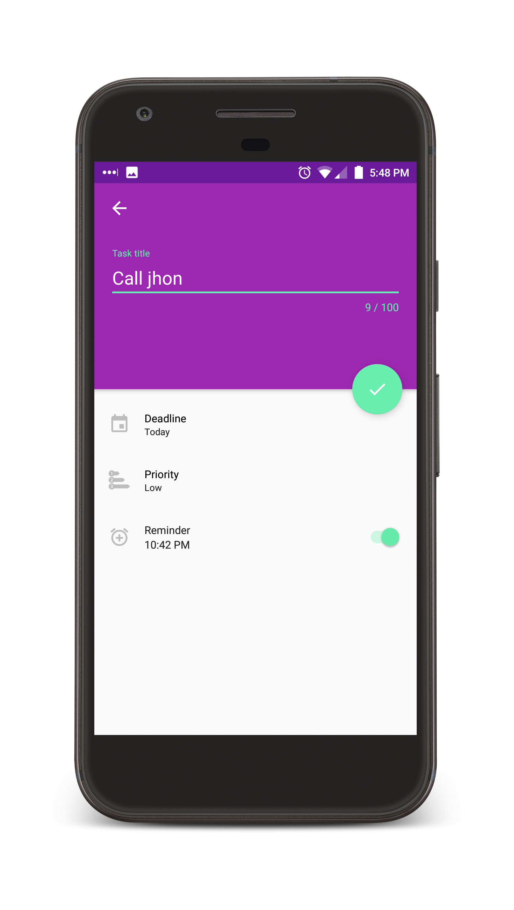
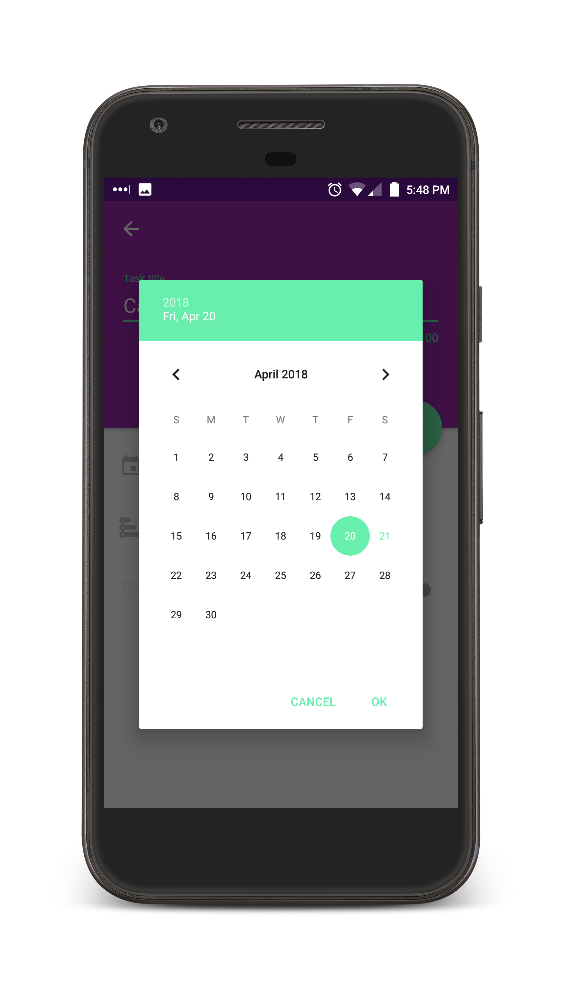
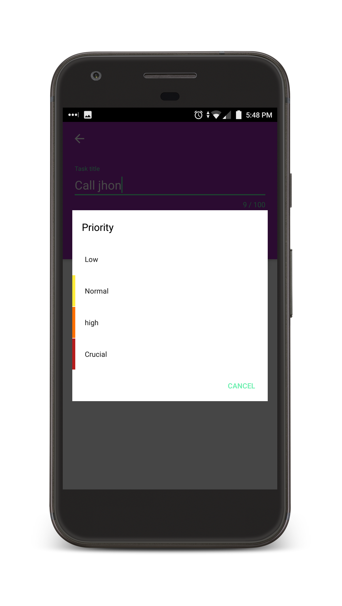

# ToDo Lite Android MVP example

Todo Lite app, is a wokring(production ready) sample that showcases the **MVP Pattern** Implementation.

## Screenshots:

## App features

- Login/Register 
- Add Task
- Update Task
- Delete/Complete Task by swiping the card left/right
- Set Reminder on the Task. User will be notified by notification.

## Project structure

**data**: Implementation of the Repository pattern, contains all the data accessing. 
**di**: Contains the classes that provide dependencies using Dagger2. 
**ui**: MVP structure, all Activities, Fragments and UI elements in this package. 
**util**: Utility classes. 

## Libraries Used
* Authentication
    * [Firebase Auth SDK](https://firebase.google.com/docs/auth/) SDK is to perform login and registration.
* Database
    * [Firebase Real Time Database](https://firebase.google.com/docs/database/) to save data locally and a sync across devices.
* Schedule Reminder   
    * [Firebase JobDispatcher](https://github.com/firebase/firebase-jobdispatcher-android) to schedule a task reminder
* Communication b/w data and Ui layer
    * [RxJava 2](https://github.com/ReactiveX/RxJava) and [RxAndroid 2](https://github.com/ReactiveX/RxAndroid) for interacting b/w data and UI by wrapping Firebase database callbacks into Observables.
* Dependency Injection    
    * [Dagger 2](https://github.com/google/dagger) to manage App, Service, Data, Utils module dependencies.
* Logging   
    * [Timber](https://github.com/JakeWharton/timber) to perform logging through out the app.
* Other   
    * [RxBindings 2](https://github.com/JakeWharton/RxBinding) and [ButterKnife](https://github.com/JakeWharton/butterknife) to reduce boilerplate code for View and events listener

## Code quality 
  
  * For maintaining code quality `findbugs`, `pmd` and `lint` is integrated. It's important to have these checks. Because later these tools will helps us to maintain less buggy code. You can perform all of them at once by executing `./gradlew check`
  * [Circle CI](https://travis-ci.org/) with [Firebase Test Lab](https://firebase.google.com/docs/test-lab/) is used for automating continuous integration and run Android test quickly.
  * The project aims to maintain high test coverage (in-progress).
  * Libraries used for testing
  
    * Junit
    * Mockito
  
## Future work

## License

    Copyright 2018 Waleed Sarwar

    Licensed under the Apache License, Version 2.0 (the "License");
    you may not use this file except in compliance with the License.
    You may obtain a copy of the License at

       http://www.apache.org/licenses/LICENSE-2.0

    Unless required by applicable law or agreed to in writing, software
    distributed under the License is distributed on an "AS IS" BASIS,
    WITHOUT WARRANTIES OR CONDITIONS OF ANY KIND, either express or implied.
    See the License for the specific language governing permissions and
    limitations under the License.

